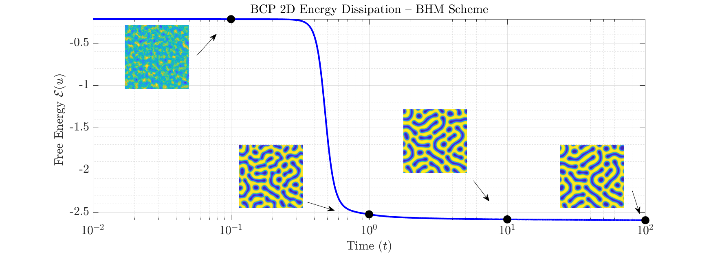

# RCS_CH_2026
A Second-Order Richardson--Convex Splitting Method for the 
Cahn-Hilliard Equation: Stability Analysis and GPU-Accelerated 
3D Computations

## Overview
We propose the Richardson--Convex Splitting (RCS) framework, 
a second-order temporal discretization based on composition 
of first-order CS operators. The scheme eliminates the parasitic 
spectral root present in BDF2-CS, requires a relaxed splitting 
parameter ($a \geq 1$ vs $a \geq 4$), and scales to $256^3$ 
3D simulations on consumer GPU hardware.

## Requirements
- MATLAB with Parallel Computing Toolbox
- NVIDIA GPU (any CUDA-capable GPU)

 
## Contents
- `BCP2D_BHM_solver.m` — 2D BHM solver function
- `BCP2D_main.m` — 2D BCP simulation script
- `BCP3D_BHM_solver.m` — 3D BHM solver function
- `BCP3D_main.m` — 3D BCP simulation script

## Output
Running **BCP2D_main.m** will generate the 2D BCP 
morphology evolution and energy dissipation figures:




## Usage
```matlab
% 2D simulation: N=128, Tf=100, dt=0.01, eps=0.1
% ubar=0 (lamellar), ubar=0.35 (spheres)
% Place BCP2D_BHM_solver.m in the same folder
run BCP2D_main.m

% 3D simulation: N=128, Tf=100, dt=0.01, eps=0.1
% ubar=0 (lamellar), ubar=0.17 (gyroid)
% Place BCP3D_BHM_solver.m in the same folder
run BCP3D_main.m
```


## Citation
If you use this code, please cite:

Orizaga, S. (2026).
"A Simple and Efficient GPU-Accelerated Spectral Scheme 
for the Block Copolymer Equation via the Biharmonic Modified Method"
Submitted to Computational Materials Science.
Code available at:
https://github.com/sauloorizaga/BHM-BCP

## Contact
We welcome questions, feedback, and potential collaboration 
opportunities — feel free to reach out! <br>
**Saulo Orizaga** — saulo.orizaga@nmt.edu <br>
Associate Professor of Mathematics <br>
New Mexico Institute of Mining and Technology <br>
Socorro, NM 87801, USA.
