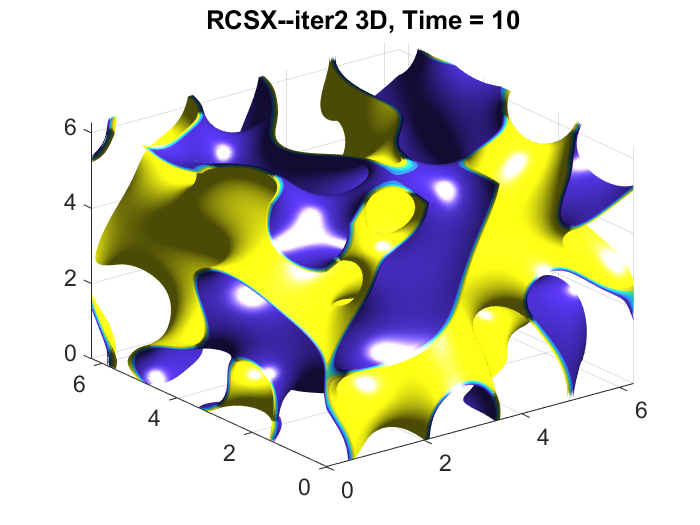
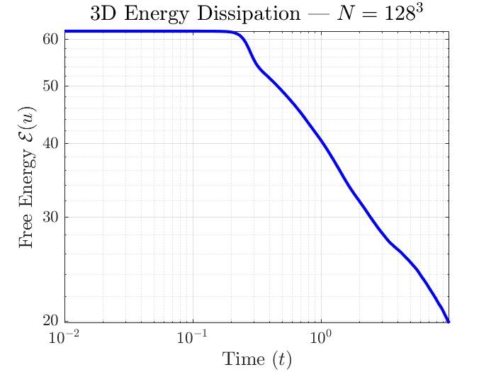

# RCS_CH_2026
A Second-Order Richardson--Convex Splitting Method for the 
Cahn-Hilliard Equation: Stability Analysis and GPU-Accelerated 
3D Computations

## Overview
We propose the Richardson--Convex Splitting (RCS) framework, 
a second-order temporal discretization based on composition 
of first-order CS operators. The scheme eliminates the parasitic 
spectral root present in BDF2-CS, requires a relaxed splitting 
parameter ($a \geq 1$ vs $a \geq 4$), and scales to $256^3$ 
3D simulations on consumer GPU hardware.

## Requirements
- MATLAB with Parallel Computing Toolbox
- NVIDIA GPU (any CUDA-capable GPU)

## Contents
- `CH3D_RCSX_Solver.m` — 3D RCS solver function
- `RCS_Simulation_Script2026.m` — run script

## Output
Running **RCS_Simulation_Script2026.m** will generate 
the 3D CH simulation and energy plot:

 

## Usage
```matlab
% Parameters: N=64, Tf=10, dt=0.01, eps=0.1
% Place CH3D_RCSX_Solver.m in the same folder
run RCS_Simulation_Script2026.m
```

## 2D Version
To adapt for 2D simulations:
- Replace `fftn/ifftn` with `fft2/ifft2`
- Replace 3D `meshgrid` with 2D version
- Replace `isosurface` with `pcolor`

## Citation
If you use this code, please cite:
Orizaga, S. (2026).
"A Second-Order Richardson--Convex Splitting Method for the 
Cahn--Hilliard Equation: Stability Analysis and GPU-Accelerated 
3D Computations"
Submitted for publication.
Code available at:
https://github.com/sauloorizaga/RCS_CH_2026

## Contact
We welcome questions, feedback, and potential collaboration 
opportunities — feel free to reach out! <br>
**Saulo Orizaga** — saulo.orizaga@nmt.edu <br>
Associate Professor of Mathematics <br>
New Mexico Institute of Mining and Technology <br>
Socorro, NM 87801, USA.
